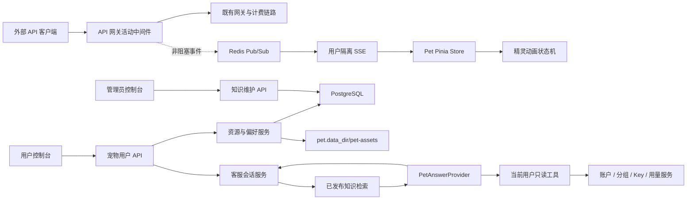

# IKIK 宠物客服系统架构

## 1. 目标

宠物客服是用户控制台的常驻能力，不绑定某个页面组件的生命周期。它同时承担两件事：

1. 展示用户选择的 Codex Pet，并对该用户的 API 请求开始、成功和失败做动画反馈。
2. 回答 IKIK 使用问题，但只能引用管理员已发布的 IKIK 知识文档；没有可靠依据时必须拒答。

本系统不读取用户通过 API 发送的提示词、模型响应正文、密钥或管理员私密数据。客服回答使用用户在宠物大厅选择的分组，复用站内 Playground 的网关链路，因此正常计入该用户的余额或订阅额度，并经过并发、风控、调度和用量记录。

## 2. 模块边界



| 模块 | 责任 | 不负责 |
| --- | --- | --- |
| 资源校验与存储 | ZIP 安全校验、WebP/画布/透明格校验、用户归属、文件持久化 | 动画播放、客服回答 |
| 用户偏好 | 开关、宠物选择、大小、位置、减少动画、API 动作开关 | 资源二进制 |
| 动画状态机 | API 并发计数、状态优先级、精确帧数和时长 | API 请求内容 |
| 活动事件 | 用户隔离、开始/完成/失败、SSE 传输 | 可靠消息队列、计费依据 |
| 知识库 | 草稿/发布/归档、版本、管理员维护 | 用户私密数据 |
| 客服编排 | 会话、检索、引用、拒答、回答提供商、只读工具编排 | 任意写操作、通用聊天 |

禁止把这些边界合并成一个巨型 PetService 或前端组件。存储、检索、回答提供商和事件总线都保留独立接口。

## 3. 数据模型

迁移按顺序执行：

- `backend/migrations/225_pet_assistant.sql`：核心资源、偏好、知识库与会话表。
- `backend/migrations/226_awesome_codex_pet_catalog.sql`：内置宠物目录、授权信息与默认右下角位置。
- `backend/migrations/227_pet_assistant_group.sql`：用户选择的 AI 客服计费分组。

| 表 | 说明 |
| --- | --- |
| `pet_assets` | 宠物元数据。用户资源带 `owner_user_id`；`NULL` 表示内置目录资源，并保留上游授权信息 |
| `pet_user_preferences` | 每个用户一行的显示、动画与归一化拖动位置偏好 |
| `pet_knowledge_documents` | 管理员维护的 IKIK 知识，只有 `published` 可检索 |
| `pet_conversations` | 用户隔离的客服会话 |
| `pet_messages` | 用户/助手消息、引用快照和拒答标记 |

资源读取、删除、偏好选择和会话读取都必须同时校验当前用户 ID。管理员知识接口位于管理员鉴权与审计日志中间件之后。

## 4. Codex Pet 资源契约

上传 ZIP 只允许根目录存在：

- `pet.json`
- `spritesheet.webp`

限制：

- ZIP 最大 10 MiB，最多 8 个目录项，展开后最大 12 MiB。
- 拒绝路径穿越、嵌套路径、重复文件和额外文件。
- `pet.json` 使用严格 JSON 字段校验，只允许一个 JSON 对象。
- `spritesheet.webp` 必须是有效 WebP。
- 每格固定 `192x208`，每行 8 格。
- v1 为 `1536x1872`、9 行；v2 为 `1536x2288`、11 行且 `spriteVersionNumber = 2`。
- 所有应使用的格必须包含非透明像素；标准动画行尾的未使用格必须全透明。

标准动画：

| 行 | 状态 | 使用格 | 播放时长 |
| ---: | --- | ---: | --- |
| 0 | idle | 6 | 280, 110, 110, 140, 140, 320 ms |
| 1 | running-right | 8 | 每格 120 ms，末格 220 ms |
| 2 | running-left | 8 | 每格 120 ms，末格 220 ms |
| 3 | waving | 4 | 140, 140, 140, 280 ms |
| 4 | jumping | 5 | 每格 140 ms，末格 280 ms |
| 5 | failed | 8 | 每格 140 ms，末格 240 ms |
| 6 | waiting | 6 | 每格 150 ms，末格 260 ms |
| 7 | running | 6 | 每格 120 ms，末格 220 ms |
| 8 | review | 6 | 每格 150 ms，末格 280 ms |
| 9-10 | 16 个环视方向 | 每行 8 | v2 专用 |

前端只播放每行实际使用的格，不能固定循环 8 格，否则 idle、waving、waiting、running 和 review 会闪到透明格。启用减少动画后固定展示当前状态第一格。

未选择资源时显示普通客服图标。用户可在宠物大厅上传自己的兼容 ZIP。默认宠物资源随前端打包，其余目录资源按可视区域懒加载。

## 5. API 活动事件

事件只包含：

```json
{
  "id": "uuid",
  "type": "api.request",
  "status": "started",
  "endpoint": "/v1/responses",
  "request_id": "optional",
  "occurred_at": "UTC timestamp"
}
```

不会进入事件的数据：

- 请求体、提示词和附件
- 模型响应和流内容
- API Key、Cookie、OAuth Token
- 账号、余额、订单、代理详情

追踪聊天、Responses、Embeddings、生图、视频、语音、搜索和 Gemini `generateContent`。不追踪模型列表、用量查询、`count_tokens`、异步任务查询、视频内容下载和取消操作。

网关将事件写入容量为 2048 的进程内有界队列，再发布到 `pet:activity:user:<user_id>`。队列满、Redis 超时或无人订阅时直接丢弃动画事件，绝不能阻塞或改变 API 请求、上游转发和计费结果。

前端使用 SSE 订阅，断开后以 1 秒到 15 秒指数退避重连。并发请求使用计数器，只有全部结束后才从 running 切到成功或空闲。

## 6. 客服回答链路

```text
问题校验
  -> 获取或创建当前用户会话
  -> 保存用户消息
  -> 只读取 status=published 的知识
  -> 中英文检索（英文词 + 中文 2-4 字 n-gram）
  -> 最多选择 3 个文档并生成引用快照
  -> PetAnswerProvider
  -> 保存助手消息
```

`PetAnswerProvider` 的输入只有：

- 当前登录用户 ID 与用户选择的分组 ID
- 当前问题
- 检索出的公开文档引用和摘录
- 模型从白名单中选择的工具名与参数；工具执行时的用户 ID 始终由服务端认证上下文注入

模型提供商不接收 API Key 明文、账号凭据、支付凭据、代理凭据或管理员数据。它通过现有 `PlaygroundHandler` 为该用户取得或创建分组专用 Playground Key，并进入正常网关；模型从该分组可用的文本模型中自动选择。检索不到已发布文档、且问题与白名单工具无关时，直接返回 `refused=true`，不调用模型也不产生模型用量。

第一阶段只开放四个只读工具：

| 工具 | 返回范围 |
| --- | --- |
| `get_my_account_overview` | 当前用户状态、余额、积分、并发与 RPM |
| `list_my_available_groups` | 当前用户可用分组、平台、实际倍率、订阅限制与生图能力 |
| `list_my_api_keys` | 当前用户 Key 的名称、状态、额度、限流窗口与有效期；过滤 Playground Key，永不返回 Key 明文 |
| `get_my_usage_summary` | 当前用户今日及最近 1-30 天实际扣费与平台汇总 |

工具 schema 不接受 `user_id`，未知工具、未知参数和越界参数一律拒绝。一次提问最多执行四个工具，不提供刷新、重置、删除、充值或配置修改等写工具。工具请求采用两轮模型流程：第一轮选择工具，服务端执行后第二轮组织最终回答，因此使用工具时通常产生两次正常计费的模型调用。

未来模型实现必须遵守：

1. 系统提示要求只依据输入引用回答，禁止使用模型记忆补充 IKIK 事实。
2. 输出引用只能来自输入文档 ID、slug 和版本。
3. 无充分依据时返回拒答，不能猜测。
4. 只能使用明确注册的当前用户只读工具，禁止增加通用数据库或管理 API 工具。
5. 不允许配置绕过用户计费的独立模型 Key；调用失败时明确报错，不伪造回答。

如果未来需要回答订单、代理等其他私密问题，应新增独立白名单工具。每个工具必须从认证上下文取得当前用户 ID、只返回最少字段，并禁止由模型传入任意用户 ID；任何写工具都必须另行设计确认、幂等、审计和权限边界，不能直接复用当前只读执行器。

## 7. HTTP 接口

用户接口：

| 方法 | 路径 | 用途 |
| --- | --- | --- |
| GET | `/api/v1/pet/assets` | 当前用户可见宠物 |
| POST | `/api/v1/pet/assets/import` | 导入 Codex Pet ZIP |
| GET | `/api/v1/pet/assets/:id/spritesheet` | 鉴权读取精灵图 |
| DELETE | `/api/v1/pet/assets/:id` | 删除用户自己的宠物 |
| GET/PUT | `/api/v1/pet/preferences` | 读取/保存偏好 |
| GET | `/api/v1/pet/activity/stream` | 用户隔离 SSE |
| POST | `/api/v1/pet/chat` | 提问 |
| GET | `/api/v1/pet/conversations/:id` | 读取当前用户会话 |

管理员接口：

| 方法 | 路径 | 用途 |
| --- | --- | --- |
| GET/POST | `/api/v1/admin/pet-knowledge` | 列表/创建 |
| PUT/DELETE | `/api/v1/admin/pet-knowledge/:id` | 更新/删除 |

管理页面：`/admin/pet-knowledge`。用户设置位于个人中心的 `/pet` 宠物大厅；宠物组件挂载在所有已登录账号的 `AppLayout`，路由切换不会销毁。默认位置为右下角，鼠标和触摸拖动后会按视口比例持久化，自适应不同窗口尺寸。

内置目录来自 [`legeling/awesome-codex-pet`](https://github.com/legeling/awesome-codex-pet)，迁移 `226_awesome_codex_pet_catalog.sql` 固化目录元数据、哈希、尺寸与逐宠物授权。上游地址只作为首次下载来源：服务器首次读取某只内置宠物时校验大小、WebP 文件头与 SHA-256，然后持久化到 `<pet.data_dir>/pet-assets/catalog`；后续请求和服务重启后均从本地读取，同一资源的并发首次请求只下载一次。大体积精灵图不写入数据库。默认宠物为 v1 `蝴蝶忍`；前端同时内置该精灵图作为首屏与离线回退资源。

## 8. 部署

1. 执行数据库迁移 225、226、227（生产环境使用项目现有迁移器按版本顺序执行）。
2. 配置 `pet.data_dir`，默认 `./data`。
3. 容器部署必须持久化 `<pet.data_dir>/pet-assets`。多后端实例部署时必须使用共享文件系统，或实现新的 `PetAssetStorage`（S3/OSS）替换本地存储。
4. Redis 必须可被所有后端实例访问，才能让任意网关实例的事件到达任意 SSE 实例。
5. 反向代理对 `/api/v1/pet/activity/stream` 禁用响应缓冲，并允许长连接。服务已发送 `X-Accel-Buffering: no` 和 20 秒心跳。
6. 管理员先在知识库页面创建并发布 IKIK 文档。没有已发布文档时，客服会严格拒答。

## 9. 失败策略

| 故障 | 行为 |
| --- | --- |
| Redis 不可用或队列满 | 丢弃动画事件，API 请求继续 |
| SSE 断开 | 前端自动重连，当前 API 调用不受影响 |
| 无匹配知识 | 明确拒答并建议改写或联系人工 |
| 回答提供商失败 | 返回客服错误，不伪造答案 |
| ZIP/画布/透明格不合法 | 导入前拒绝，不写数据库 |
| 内置宠物首次下载失败或校验不通过 | 不写服务器缓存，向用户返回资源错误，后续请求可重新尝试 |
| 数据库写资源失败 | 删除已写入的文件 |
| 删除资源时文件已不存在 | 以数据库删除结果为准 |

## 10. 验证范围

- 后端：中文检索、相关文档排序、无依据拒答、ZIP 路径与额外文件、标准帧布局、内置资源持久缓存/并发去重/哈希校验、活动端点筛选、网关路由。
- 前端：TypeScript/Vue 类型检查、动画行与实际帧数测试、生产构建。
- 界面：桌面和移动端、暗色模式、宠物与新手任务 Dock 避让、客服面板不越界、管理知识编辑页。
