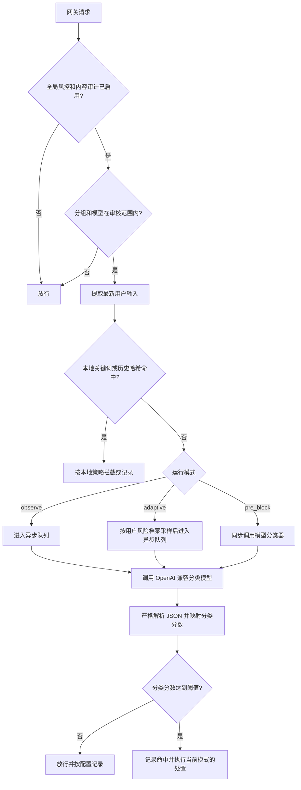

# 风控中心模型分类器

本文介绍管理端“风控中心”中的 `model_classifier` 内容安全服务商。它允许 ikik-api 使用任意 OpenAI Chat Completions 兼容模型，对网关请求的最新用户输入进行结构化风险分类，并复用现有的阈值、拦截、通知、风险档案和审计日志能力。

> 本文描述的是 `/admin/risk-control` 下的模型分类器，不是 `/admin/prompt-audit` 使用的 Qwen3Guard。两者可以同时启用，但配置、分类体系、队列和失败策略彼此独立。

## 1. 定位

模型分类器不是新的网关模型，也不直接生成用户答案。它是风控中心的一种审核后端：

- 输入：网关从当前请求中提取出的最新最终用户输入。
- 推理：调用配置的 OpenAI 兼容 `/v1/chat/completions` 模型。
- 输出：固定 JSON 分类结果。
- 决策：将分类置信度映射为风控分类分数，再与管理员配置的分类阈值比较。
- 处置：按 `off`、`observe`、`pre_block` 或 `adaptive` 模式记录、通知、拦截或更新用户风险档案。

启用时需要同时满足两个开关：

1. 系统设置中的全局 `risk_control_enabled=true`。
2. 风控中心内容审计配置中的 `enabled=true`，且模式不是 `off`。

## 2. 请求处理流程



模型调用失败不会让普通请求失败。当前实现对模型超时、网络错误、非 2xx、无 `choices`、非法 JSON、非法决策或非法分类均采用 **fail-open**：放行原请求；开启 `record_non_hits` 时会记录错误。`pre_block` 因此不是一个严格的 fail-closed 边界。

## 3. 审核输入边界

系统支持以下入口协议：

| 协议 | 取值位置 |
| --- | --- |
| Anthropic Messages | 最后一条 `role=user` 消息 |
| OpenAI Chat Completions | 最后一条 `role=user` 消息 |
| OpenAI Responses | `input` 中最后一个用户输入项 |
| Gemini | `contents` 中最后一个用户内容 |
| OpenAI Images / Grok 媒体 | `prompt` 及请求图片 |

提取遵循以下约束：

- 只审核最新用户输入，不拼接更早的对话历史。
- 排除 system/developer 指令、assistant 消息、工具调用和工具结果。
- 如果当前轮最后一项是 assistant 或工具结果，文本审核会跳过，避免把模型输出误判成用户输入。
- 文本会压缩空白并截断到最多 12,000 个 Unicode 字符。
- 请求包含多张图片时，单次审核最多抽取 1 张；分类模型需要自行支持对应的多模态 Chat Completions 格式。
- 审计日志只保存脱敏后的最多 240 个字符摘要，不保存图片内容。

这些边界用于降低上下文污染和误报。分类器仍需结合意图、目标、授权情况和操作细节判断，不能只依赖关键词。

## 4. OpenAI 兼容调用协议

分类器固定请求：

```http
POST {base_url}/v1/chat/completions
Authorization: Bearer <api-key>
Content-Type: application/json
X-Ikik-Moderation-Signature: <hmac-sha256>
```

请求体示意：

```json
{
  "model": "your-classifier-model",
  "messages": [
    {
      "role": "system",
      "content": "<内置或自定义分类策略>\n\n<系统固定输出契约>"
    },
    {
      "role": "user",
      "content": "Audit the latest end-user input below...\n<最新用户输入>"
    }
  ],
  "stream": false
}
```

为兼容更多模型服务，系统不会强制发送 `temperature` 或 `response_format`。模型必须在首个 `choices[0].message.content` 中返回以下 JSON；解析器也兼容外层 Markdown JSON 代码块。

风控中心历史默认模型名是 `omni-moderation-latest`，但模型分类器调用的是 Chat Completions，而不是 Moderations。选择 `model_classifier` 后必须显式填写一个支持 `/v1/chat/completions` 的聊天模型；如果需要审核图片，该模型还必须支持多模态 `image_url` 输入。

```json
{
  "decision": "safe",
  "category": "none",
  "confidence": 0.99,
  "severity": 0
}
```

字段约束：

| 字段 | 允许值 | 说明 |
| --- | --- | --- |
| `decision` | `safe`、`suspicious`、`high_risk` | 分类结论 |
| `category` | `none` 或系统固定分类 | `safe` 时会被强制归一为 `none` |
| `confidence` | `0.0` 到 `1.0` | 超出范围时会被截断 |
| `severity` | `0` 到 `3` | `safe` 强制为 0；其他决策归一到 1 到 3 |

管理员可以修改“分类策略提示词”来调整判断边界，但不能修改 JSON 字段和分类枚举。自定义策略会替换内置政策正文，系统仍会在末尾追加固定输出契约。自定义策略最多 20,000 个 Unicode 字符。

## 5. 分类体系

### 5.1 网关滥用分类

| 模型分类 | 内部分类 | 默认阈值 | Adaptive 风险分 |
| --- | --- | ---: | --- |
| `safety_bypass` | `gateway_abuse/safety_bypass` | 0.80 | 中；分数不低于 0.90 时严重 |
| `credential_theft` | `gateway_abuse/credential_theft` | 0.80 | 当前不累计 |
| `account_automation` | `gateway_abuse/account_automation` | 0.80 | 分数不低于 0.80 时严重，否则中 |
| `auth_reverse_engineering` | `gateway_abuse/auth_reverse_engineering` | 0.80 | 中 |
| `exploit_reverse_engineering` | `gateway_abuse/exploit_reverse_engineering` | 0.82 | 中 |
| `cheat_automation` | `gateway_abuse/cheat_automation` | 0.82 | 中 |
| `other` | `gateway_abuse/other` | 0.85 | 当前不累计 |

### 5.2 通用政策分类

| 模型分类 | 内部分类 | 默认阈值 |
| --- | --- | ---: |
| `harassment_or_defamation` | `policy/harassment_or_defamation` | 0.88 |
| `self_harm` | `policy/self_harm` | 0.85 |
| `sexual_or_nonconsensual` | `policy/sexual_or_nonconsensual` | 0.85 |
| `violence_terrorism_or_hate` | `policy/violence_terrorism_or_hate` | 0.85 |
| `weapons` | `policy/weapons` | 0.85 |
| `illicit_goods_or_services` | `policy/illicit_goods_or_services` | 0.85 |
| `cyber_abuse` | `policy/cyber_abuse` | 0.82 |
| `real_money_gambling` | `policy/real_money_gambling` | 0.90 |
| `unlicensed_high_stakes_advice` | `policy/unlicensed_high_stakes_advice` | 0.88 |
| `privacy_or_sensitive_data` | `policy/privacy_or_sensitive_data` | 0.85 |
| `biometric_or_social_profiling` | `policy/biometric_or_social_profiling` | 0.88 |
| `minor_exploitation` | `policy/minor_exploitation` | 0.75 |
| `minor_unsafe_content` | `policy/minor_unsafe_content` | 0.82 |
| `fraud_spam_or_impersonation` | `policy/fraud_spam_or_impersonation` | 0.84 |
| `academic_dishonesty` | `policy/academic_dishonesty` | 0.90 |
| `political_manipulation` | `policy/political_manipulation` | 0.88 |
| `high_stakes_automation` | `policy/high_stakes_automation` | 0.85 |
| `national_security_or_intelligence` | `policy/national_security_or_intelligence` | 0.88 |
| `ip_infringement` | `policy/ip_infringement` | 0.90 |

通用政策分类可以触发审核命中、`pre_block` 拦截、日志和非 Adaptive 模式的通知/累计，但当前不会增加 Adaptive 用户风险分。

## 6. 从模型结论到系统命中

模型分类器不会直接把 `decision` 当作最终拦截结论。系统执行以下归一化：

1. `safe`：所有分类分数为 0，不命中。
2. `suspicious` 或 `high_risk`：只给返回的一个分类写入 `confidence`，其他分类为 0。
3. 系统重新比较 `category_score >= category_threshold`，得到最终 `flagged`。
4. 只有 `pre_block` 模式下的 `flagged` 才会同步拒绝当前请求。

例如：

```json
{
  "decision": "high_risk",
  "category": "safety_bypass",
  "confidence": 0.94,
  "severity": 3
}
```

会映射为 `gateway_abuse/safety_bypass=0.94`。默认阈值是 0.80，因此判定命中；在 `pre_block` 下阻止当前请求，在 Adaptive 风险档案中属于严重事件。

需要注意：`decision`、`confidence` 和 `severity` 承担不同职责。

- `confidence` 与分类阈值决定是否命中。
- `decision` 和 `severity` 参与模型分类器的直接风险级别判断。
- Adaptive 模式还会按命中分类和分数补充风险级别，因此达到阈值的 `suspicious` 网关滥用分类也可能增加用户风险分。

## 7. 运行模式

| 模式 | 分类器调用 | 当前请求 | 后续影响 |
| --- | --- | --- | --- |
| `off` | 不调用 | 放行 | 不记录 |
| `observe` | 异步 | 立即放行 | 记录命中；可通知并按旧规则累计自动封禁 |
| `pre_block` | 同步 | 达到阈值时拒绝；分类器异常时放行 | 记录、风险哈希、通知和累计封禁 |
| `adaptive` | 按用户风险档案异步采样 | 分类器本身不阻止当前请求 | 更新风险档案，并按 `shadow`、`notify`、`enforce` 处置 |

如果启用了“前置哈希比对”，已记录的风险输入哈希可在模型调用前直接拦截；这是独立于模型分类器的本地快速路径，在 Adaptive 模式下也可能阻止当前请求。

Adaptive 默认策略：

- 新用户前 100 次请求：100% 审核。
- 100 到 300 次的过渡阶段：30% 审核。
- 可信用户：5%；观察用户：50%；高风险和严重用户：100%。
- 风险分每日衰减 10%。
- 中风险事件增加 12 分，严重事件增加 30 分。
- `watch`、`high`、`critical` 默认阈值分别为 40、60、80。
- 默认执行方式是 `shadow`，只建档不通知、不禁用 Key。
- `notify` 会按冷却周期通知；`enforce` 仅在档案达到 `critical` 且本次为严重事件时禁用触发请求的 API Key。管理员账号不会被自动处置。

## 8. API Key、重试与递归保护

风控中心支持保存多个分类器 API Key：

- Key 按轮询方式选择，并跳过临时冻结的 Key。
- 总尝试次数为 `retry_count + 1`，`retry_count` 最大为 5。
- 重试间隔按 100ms、200ms 等线性增加。
- HTTP 400 视为请求或模型契约问题，不继续重试，也不冻结 Key。
- HTTP 401/403 冻结对应 Key 10 分钟。
- HTTP 429/529 冻结 1 分钟。
- 其他 HTTP 错误冻结 10 秒。
- 每个 Key 的成功数、失败数、最近状态、延迟和同步负载可在风控中心查看。

分类器可以通过 ikik-api 自己的 OpenAI 兼容网关访问模型。为防止“审核请求再次触发审核”的递归，出站分类请求携带基于请求体和当前 API Key 计算的 `X-Ikik-Moderation-Signature`。同一实例收到合法签名后只会跳过这次内部请求的风控中心模型分类器检查。该 Header 不应由普通客户端自行构造或依赖。

这个签名不是 Prompt Audit 的通用旁路。如果分类器回环到同时开启 Prompt Audit 的 ikik-api 实例，内部分类请求仍可能进入 Prompt Audit，部署前需要单独验证并避免形成跨引擎回环。

## 9. 日志与数据处理

审核记录位于 `content_moderation_logs`，主要包含：

- 请求、用户、API Key、分组、入口、上游平台和目标模型信息。
- 运行模式、动作、最高分类、最高分、完整分类分数和当时的阈值快照。
- 分类器延迟、异步排队延迟和错误摘要。
- 命中次数、邮件状态和自动封禁状态。
- 最新用户文本的脱敏摘要。

摘要在入库前会移除 URL、Authorization/Bearer、常见 API Key、Token、密码、长十六进制串、JWT、UUID 和长 Base64/随机串，并截断为 240 个字符。命中记录默认保留 180 天；未命中记录只有在 `record_non_hits=true` 时保存，且最多保留 3 天。

命中输入可以写入 Redis 风险哈希集合，用于后续前置哈希拦截。误报时可在管理端删除单个 64 位 SHA-256 哈希，或清空整个集合；删除哈希不会删除已有审核日志。

## 10. 推荐上线步骤

1. 在系统设置中开启风控中心全局开关。
2. 选择“模型分类器”，填写 Base URL、模型和至少一个 API Key。
3. 使用“测试 Key/试跑内容”检查连通性、返回 JSON 和分类阈值结果。
4. 首先使用 `observe`，或使用 `adaptive + shadow`，收集真实流量中的误报和漏报。
5. 调整分类策略提示词和分类阈值。优先补充授权、运维、研究和业务上下文，不建议靠大量关键词扩大拦截面。
6. 配置多个 Key、合理超时和重试，观察 Key 冻结、队列使用率、错误率和 P95 延迟。
7. 只有在样本验证完成后再启用 `pre_block` 或 Adaptive `enforce`。

一个适合试运行的配置示意：

```json
{
  "enabled": true,
  "mode": "observe",
  "moderation_provider": "model_classifier",
  "base_url": "https://classifier.example.com",
  "model": "your-classifier-model",
  "classifier_prompt": "",
  "timeout_ms": 3000,
  "retry_count": 2,
  "sample_rate": 10,
  "all_groups": true,
  "record_non_hits": false
}
```

API Key 通过独立字段添加，示例中故意省略。生产配置不应把真实 Key 写入文档或版本库。

## 11. 与 Prompt Audit 的区别

| 项目 | 风控中心模型分类器 | Prompt Audit / Qwen3Guard |
| --- | --- | --- |
| 管理入口 | `/admin/risk-control` | `/admin/prompt-audit` |
| 模型协议 | OpenAI Chat Completions 兼容 | OpenAI Chat Completions 兼容的 Qwen3Guard 节点 |
| 分类体系 | 26 个网关滥用和通用政策分类 | Qwen3Guard 九类输入风险 |
| 运行方式 | `observe`、`pre_block`、`adaptive` | 异步审计或同步阻断 |
| 队列 | 进程内异步队列 | 持久任务队列 |
| 同步失败策略 | fail-open | Blocking 模式下无效响应或节点不可用时 fail-closed，返回 503 |
| 主要用途 | 阈值拦截、通知、历史哈希、用户风险档案 | 独立提示词安全事件与同步 Guard |

统一安全审计链会保留风控中心的处理结果，并按 Prompt Audit 配置继续执行独立审计。两者同时阻断时，风控中心原有阻断结果保持最高优先级。

## 12. 代码索引

- 分类策略、请求协议、JSON 解析和分类映射：`backend/internal/service/content_moderation_classifier.go`
- 模式、阈值、Key 轮换、日志和处置：`backend/internal/service/content_moderation.go`
- Adaptive 采样、风险分和执行策略：`backend/internal/service/content_moderation_adaptive.go`
- 多协议最新用户输入提取：`backend/internal/service/content_moderation_input.go`
- 日志摘要脱敏：`backend/internal/service/content_moderation_redact.go`
- 管理页面：`frontend/src/views/admin/RiskControlView.vue`
- 管理 API 类型与调用：`frontend/src/api/admin/riskControl.ts`
- 与 Prompt Audit 的协调：`backend/internal/securityaudit/coordinator.go`
